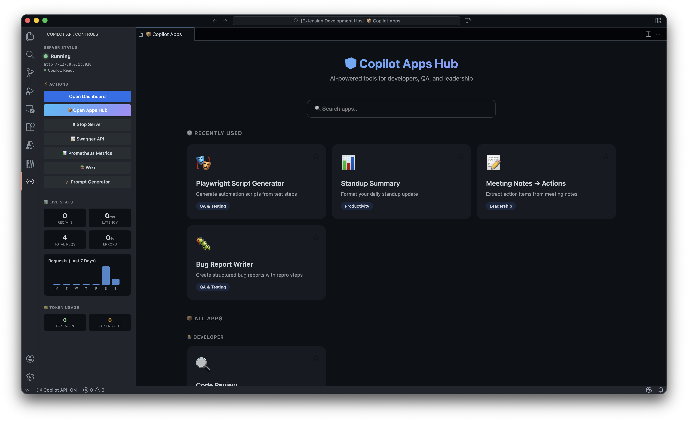
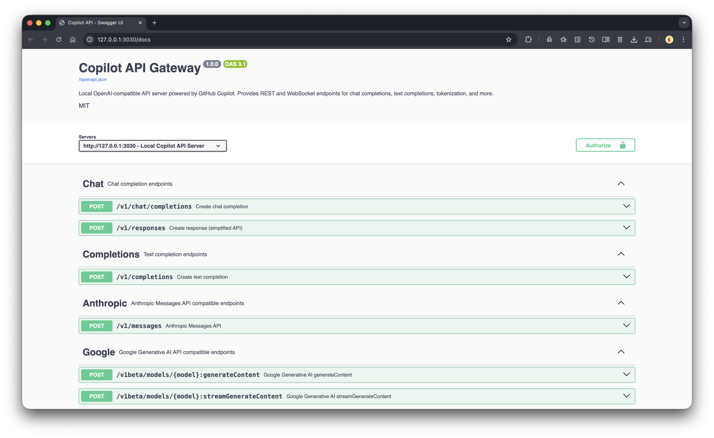
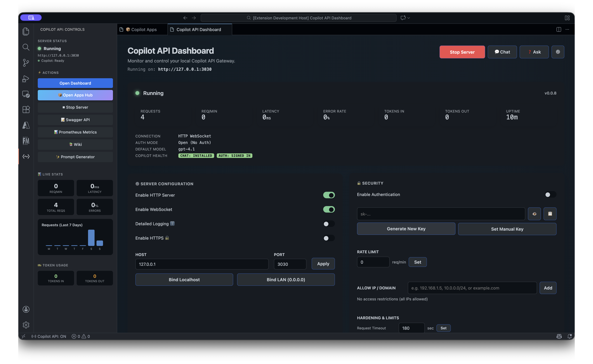

<p align="center">
  
</p>

<h1 align="center">GitHub Copilot API Gateway</h1>

<p align="center">
  <strong>Transform your GitHub Copilot subscription into a complete AI development platform.</strong>
</p>

<p align="center">
  <a href="https://marketplace.visualstudio.com/items?itemName=suhaibbinyounis.github-copilot-api-vscode">
    
  </a>
  <a href="https://github.com/suhaibbinyounis/github-copilot-api-vscode/releases">
    
  </a>
  <a href="https://opensource.org/licenses/MIT">
    
  </a>
</p>

<p align="center">
  <a href="#-enterprise-apps-hub">Apps Hub</a> •
  <a href="#-api-gateway">API Gateway</a> •
  <a href="#-getting-started">Getting Started</a> •
  <a href="#-configuration">Configuration</a> •
  <a href="#-integrations">Integrations</a>
</p>

---

## Why This Extension?

**GitHub Copilot API Gateway** is more than just an HTTP server—it's a **complete AI development platform** that maximizes your Copilot subscription:

| What You Get | Without This Extension | With This Extension |
|--------------|----------------------|---------------------|
| **AI Apps** | None | 30+ enterprise-grade apps built into VS Code |
| **API Access** | None | Full OpenAI, Anthropic, Google API compatibility |
| **External Tools** | Limited | LangChain, AutoGPT, CrewAI, and 50+ frameworks |
| **MCP Support** | None | Connect any Model Context Protocol server |
| **Jira Integration** | None | Auto-fetch issue details into any app |
| **Cost** | $10/month (Copilot only) | $10/month (everything included) |

---

## 🎯 Enterprise Apps Hub

**Access powerful AI apps directly in VS Code—no external tools needed.**

Click **📦 Open Apps Hub** in the Copilot API sidebar to launch:



### Featured Apps

| Category | Apps |
|----------|------|
| 🎭 **QA & Testing** | Playwright Generator, Test Case Generator, Bug Report Writer, Accessibility Checker |
| 👥 **Leadership** | 1:1 Meeting Prep, Performance Review Writer, Team Feedback Generator |
| 💻 **Developer** | Code Review, Regex Generator, SQL Query Builder, API Doc Writer |
| 🎮 **Games** | Trivia Showdown, Story Chain, Caption Battle, Debate Arena |
| 🧘 **Wellness** | Rubber Duck Therapist, Gratitude Journal, Focus & Mindfulness |
| 📝 **Productivity** | Email Composer, Slack Polisher, Meeting Notes to Actions |

### 🔗 Jira Integration (NEW!)

**Auto-fetch Jira issue details** into any app:

1. Click **⚙️ JIRA Configuration** in Apps Hub
2. Enter your Jira URL, email, and API token
3. In apps like Playwright Generator or Test Case Generator, enter a Jira Issue ID
4. Issue summary, description, and acceptance criteria are automatically fetched as context!

### 🎭 Playwright Script Generator

The flagship app that generates **production-ready Playwright test projects**:

- **Multi-Language Support** — TypeScript, JavaScript, or Python
- **Browser Selection** — Google Chrome or Microsoft Edge
- **File Attachments** — Upload Excel, Word, TXT, or Markdown files with test steps
- **Model Selection** — Choose from all available VS Code language models
- **Complete Project Output** — Creates `package.json`, `playwright.config.ts`, and test files
- **One-Click Setup** — Ready-to-run commands for `npm install` and `npx playwright test`

```
📁 my-playwright-tests/
├── package.json           # Dependencies configured
├── playwright.config.ts   # Browser & reporter settings
└── tests/
    └── test.spec.ts       # Your generated tests
```

---

## 🌐 API Gateway

**Expose GitHub Copilot as a local HTTP server compatible with OpenAI, Anthropic, and Google SDKs.**

### Multi-Provider Compatibility

| Provider | Endpoint | Compatible SDKs |
|----------|----------|-----------------|
| **OpenAI** | `/v1/chat/completions` | openai-python, openai-node, and any OpenAI-compatible client |
| **Anthropic** | `/v1/messages` | anthropic-sdk, Claude integrations |
| **Google Gemini** | `/v1beta/models/:model:generateContent` | google-generativeai, Vertex AI clients |

All endpoints support **streaming**, **function calling**, and **tool use**.

### Interactive API Documentation

Full Swagger UI with try-it-out capabilities:



Access at `http://127.0.0.1:3030/docs` when the server is running.

---

## 🚀 Getting Started

### Prerequisites

1. **VS Code** 1.95.0 or later
2. **GitHub Copilot** extension (authenticated)
3. **GitHub Copilot Chat** extension

### Installation

```bash
# Install from VS Code Marketplace
ext install suhaibbinyounis.github-copilot-api-vscode
```

Or search "GitHub Copilot API Gateway" in the VS Code Extensions panel.

### Quick Start

#### Using Apps Hub

1. Open the **Copilot API** sidebar panel
2. Click **📦 Open Apps Hub**
3. Select any app (e.g., Playwright Generator)
4. Fill in the form and click generate

#### Using API Gateway

1. Click **▶ Start Server** in the sidebar
2. Server starts at `http://127.0.0.1:3030`
3. Use any OpenAI-compatible client:

```python
from openai import OpenAI

client = OpenAI(
    base_url="http://127.0.0.1:3030/v1",
    api_key="not-needed"  # Uses your Copilot subscription
)

response = client.chat.completions.create(
    model="gpt-4o",
    messages=[{"role": "user", "content": "Hello!"}]
)
print(response.choices[0].message.content)
```

---

## 🔧 Configuration

All settings are prefixed with `githubCopilotApi.`:

### Server Settings

| Setting | Default | Description |
|---------|---------|-------------|
| `server.host` | `127.0.0.1` | Bind address (`0.0.0.0` for LAN access) |
| `server.port` | `3030` | HTTP server port |
| `server.autoStart` | `false` | Start server when VS Code launches |
| `server.apiKey` | — | Optional Bearer token for authentication |

### Security Settings

| Setting | Default | Description |
|---------|---------|-------------|
| `server.ipAllowlist` | `[]` | Restrict to specific IPs/CIDRs |
| `server.rateLimitPerMinute` | `60` | Max requests per minute |
| `server.maxConcurrentRequests` | `4` | Max parallel requests |
| `server.maxConnectionsPerIp` | `10` | Connection limit per client |
| `server.redactionPatterns` | `[]` | Regex patterns for data masking |

### MCP Settings

| Setting | Default | Description |
|---------|---------|-------------|
| `mcp.enabled` | `true` | Enable Model Context Protocol |
| `mcp.servers` | `{}` | MCP server configurations |

---

## 🔌 Integrations

### AI Orchestration Frameworks

| Framework | Integration |
|-----------|-------------|
| **[LangChain](https://langchain.com)** | Set `base_url` to `http://127.0.0.1:3030/v1` |
| **[LlamaIndex](https://llamaindex.ai)** | Configure OpenAI backend URL |
| **[Haystack](https://haystack.deepset.ai)** | Use OpenAI generator with custom URL |
| **[Semantic Kernel](https://github.com/microsoft/semantic-kernel)** | Point OpenAI connector to gateway |

### Autonomous Agents

| Agent | Configuration |
|-------|---------------|
| **[AutoGPT](https://github.com/Significant-Gravitas/AutoGPT)** | Set `OPENAI_API_BASE` env variable |
| **[CrewAI](https://crewai.com)** | Configure base URL in agent settings |
| **[MetaGPT](https://github.com/geekan/MetaGPT)** | Use custom OpenAI endpoint |

### Development Tools

| Tool | Integration |
|------|-------------|
| **[Continue](https://continue.dev)** | Configure OpenAI provider URL |
| **[Aider](https://aider.chat)** | Use `--openai-api-base` flag |
| **[Open Interpreter](https://openinterpreter.com)** | Set API base URL |

### Example: LangChain with RAG

```python
from langchain_openai import ChatOpenAI
from langchain_community.vectorstores import Chroma
from langchain.chains import RetrievalQA

llm = ChatOpenAI(
    base_url="http://127.0.0.1:3030/v1",
    api_key="not-needed"
)

# Your RAG pipeline works with Copilot
qa_chain = RetrievalQA.from_chain_type(
    llm=llm,
    retriever=vectorstore.as_retriever()
)
```

---

## 🛠 Model Context Protocol (MCP)

Extend Copilot with external tools and data sources.

### Configuration

Add to your VS Code `settings.json`:

```json
{
  "githubCopilotApi.mcp.servers": {
    "filesystem": {
      "command": "npx",
      "args": ["-y", "@modelcontextprotocol/server-filesystem", "/path/to/folder"]
    },
    "git": {
      "command": "npx", 
      "args": ["-y", "@modelcontextprotocol/server-git"]
    }
  }
}
```

### Built-in VS Code Tools

| Tool | Description |
|------|-------------|
| `vscode_read_file` | Read file contents from workspace |
| `vscode_list_files` | List files matching a pattern |
| `vscode_open_file` | Open file in editor at specific line |
| `vscode_get_diagnostics` | Get errors and warnings |
| `vscode_get_active_editor` | Get content of current file |

---

## 📊 Dashboard & Observability

The built-in dashboard provides:

- **Real-time Statistics** — Requests, tokens, latency, error rates
- **Live Log Streaming** — Monitor API traffic as it happens
- **Full Audit Trail** — Complete request history with configurable retention
- **Usage Analytics** — Charts for daily patterns and token consumption



---

## 💰 Cost Comparison

| Solution | Monthly Cost | Local Server | API Compatible | AI Apps |
|----------|--------------|--------------|----------------|---------|
| **This Extension** | **$10** | ✅ | ✅ | ✅ |
| ChatGPT Plus | $20 | ❌ | ❌ | ❌ |
| OpenAI API | Pay-per-use | ❌ | ✅ | ❌ |
| Anthropic API | Pay-per-use | ❌ | ❌ | ❌ |

---

## 🔒 Security Features

- **IP Allowlisting** — Restrict access to specific addresses or CIDR ranges
- **Bearer Token Auth** — Optional API key protection
- **Data Redaction** — Automatically mask sensitive data in logs
- **Rate Limiting** — Configurable request thresholds
- **Connection Limits** — Control concurrent requests per IP
- **Request Timeout** — Prevent hanging connections
- **Payload Limits** — Guard against oversized requests

---

## 📝 API Reference

| Method | Endpoint | Description |
|--------|----------|-------------|
| `POST` | `/v1/chat/completions` | OpenAI chat completions |
| `POST` | `/v1/messages` | Anthropic messages |
| `POST` | `/v1beta/models/:model:generateContent` | Google Gemini |
| `GET` | `/v1/models` | List available models |
| `GET` | `/docs` | Swagger UI |
| `GET` | `/v1/usage` | Usage statistics |

---

## 🐛 Troubleshooting

<details>
<summary><strong>Server won't start</strong></summary>

1. Check if port 3030 is in use: `lsof -i :3030`
2. Verify GitHub Copilot is signed in (check VS Code status bar)
3. Ensure both Copilot extensions are installed

</details>

<details>
<summary><strong>Apps not responding</strong></summary>

1. Check GitHub Copilot Chat extension is installed
2. Verify your Copilot subscription is active
3. Try reloading VS Code window

</details>

<details>
<summary><strong>LAN access not working</strong></summary>

1. Set `server.host` to `0.0.0.0`
2. Check firewall allows port 3030
3. Use machine's IP address, not `localhost`

</details>

---

## 🤝 Contributing

Contributions are welcome! Please read our contributing guidelines before submitting PRs.

1. Fork the repository
2. Create a feature branch: `git checkout -b feature/amazing-feature`
3. Commit changes: `git commit -m 'Add amazing feature'`
4. Push to branch: `git push origin feature/amazing-feature`
5. Open a Pull Request

---

## 📄 License

MIT License — see [LICENSE](LICENSE) for details.

---

## ⚠️ Disclaimer

This extension is an independent project not affiliated with GitHub, Microsoft, or OpenAI. It leverages your existing GitHub Copilot subscription. Use responsibly and in accordance with GitHub's Terms of Service.

---

<p align="center">
  <strong>Built with ❤️ by <a href="https://suhaibbinyounis.com">Suhaib Bin Younis</a></strong>
</p>

<p align="center">
  <a href="https://github.com/suhaibbinyounis/github-copilot-api-vscode">
    
  </a>
</p>
